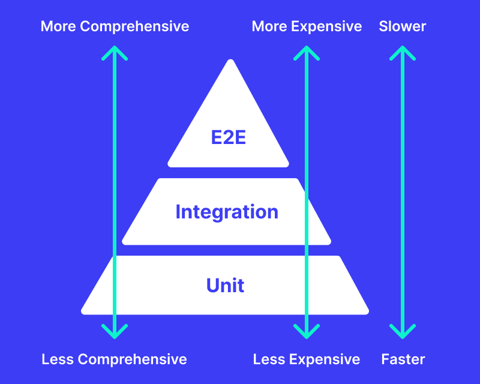

# 🧪 Test pyramid 

---

> How would you distribute tests across unit, integration, and e2e layers for this product?

I would follow the classical **test pyramid** approach to balance fast feedback, maintainability, and confidence in releases.

## 1. 🔹 **Unit Tests (Base of the Pyramid)**

Unit tests are the foundation of the pyramid and should cover the smallest, isolated pieces of functionality. These tests are critical for ensuring the correctness of individual components without relying on external dependencies.

### 🎯 What to focus on:
- **AI logic**: I prioritized testing the AI algorithms that handle crafting changes based on user input, such as interpreting task descriptions, generating code changes, and responding to specific user queries.
- **Business logic**: Ensured the core functionality that supports task creation, updating task statuses, and search in projects was well-covered by unit tests.
- **Helper utilities**: Functions related to date formatting, error handling, and any other small utility functions were tested at this layer.

## 2. 🔸 **Integration Tests (Middle Layer of the Pyramid)**

Integration tests are important to verify the interaction between multiple components or services. These tests should ensure that the system works as expected when different parts communicate with each other.

### 🎯 What to focus on:
- **Third-party integrations**: Tested the integration with external services like AI provider, Figma, slack, GitHub (for creating PRs) or the database layer to ensure that data flows correctly between the platform and external APIs.
- **AI platform integration**: Verified the interaction between the AI system and other core parts of the platform, like task creation, updating task statuses (including "unknown" status), and generating appropriate responses in the chat interface.
- **Task management**: Ensured that tasks with statuses like "unknown" were tracked and displayed properly in the stats section of the dashboard.

## 3. 🔺 **End-to-End (E2E) Tests (Top of the Pyramid)**

End-to-end tests are the slowest and most expensive to run, but they validate the overall functionality from a user's perspective. These tests simulate real-world use cases to ensure that the entire system behaves as expected.

### 🎯 What to focus on:
- **User journeys**: Focused on critical user paths like creating projects, describing tasks, interacting with the AI in different modes (Plan/Build/Find), and verifying that changes are crafted and reflected in the UI (e.g., PR creation in GitHub).
- **UI validation**: Ensured that the task stats were correctly displayed and that the dashboard behaved as expected.
- **AI interaction**: Tested that the AI responses were accurate, especially when generating code changes based on task descriptions or responding to queries in the chat interface.

## 📊 Test Pyramid Distribution:

- **Unit Tests**: ~60%  
  This layer covers the individual components, utility functions, and core business rules. It's crucial for catching bugs early and ensuring component reliability.

- **Integration Tests**: ~30%  
  These tests check interactions between components like the backend, database, and external APIs, ensuring that the system integrates smoothly.

- **End-to-End Tests**: ~10%  
  E2E tests should focus on validating entire user workflows, working on project, creation of PR, generation and UI behavior, making sure the product delivers the expected user experience.

---

# 🚀 What to automate first

---

> Given what you saw in the product, which flows are highest priority to automate and why?

Based on the platform's capabilities and the bugs identified, I would prioritize automating the following flows:

## 1. 🔐 **User Account Creation and Authentication Flows**

### 🐞 Related Found Bugs:
- "Forgot Password" request returns 500 Internal Server Error
- User account creation does not trigger welcome email
- Existing account signup attempt shows success despite backend error
- User invitation flow does not trigger invitation email

### 💡 Why Automate:
These are core features of the platform that users rely on to access and interact with the system. Issues in account creation, password recovery, or email notifications can block users from using the platform or cause confusion. Automating these flows ensures:
- Successful user registration and login with appropriate emails sent.
- Password reset and email notification flows are working as expected.
- Invited users are properly added, and invitations are triggered.

## 2. 🧩 **Task Management and Execution Flows**

### 🐞 Related Found Bugs:
- All task executions fail for project "jira-clone-test"
- Task names are not generated based on task context
- Existing task becomes inaccessible after initiating new task flow

### 💡 Why Automate:
Task management is at the core of the platform, especially with the AI-driven task generation and execution. If tasks fail to execute or users lose access to existing tasks, it directly impacts productivity. Automating these flows ensures:
- Tasks are created based on the proper context and executed correctly.
- Users don’t experience issues with accessibility to tasks after creating or modifying them.
- AI logic behind task creation is tested for accuracy and context-awareness.

## 3. 🖥️ **Project Initialization and UI Consistency**

### 🐞 Related Found Bugs:
- Project initialization status UI displays inconsistent progress information
- Studio UI does not display all files included in pull request

### 💡 Why Automate:
UI consistency is crucial for providing a reliable user experience. Users depend on accurate progress information and visibility into project details, including pull request files. Automating these flows ensures:
- Project initialization and progress are correctly displayed and updated, avoiding misleading information.
- All files included in pull requests are visible in the studio UI, ensuring no important details are missed during code review.

## 4. 🔀 **Pull Request Generation and Backend Integration**

### 💡 Related Found Bugs:
- Empty initial commit is always included in generated pull requests

### 🐞 Why Automate:
A key part of the user flow involves creating pull requests with the correct commits. If the platform is incorrectly adding empty commits, it could result in unnecessary or erroneous changes being introduced into the codebase. Automating this flow ensures:
- Commits included in pull requests are correctly filtered and validated, with no empty commits.
- Backend logic for generating pull requests is verified to ensure commits are processed properly.

---

# ⚙️ CI/CD integration

> How would you structure test runs (PR checks, nightly, release gates)?

I would structure test runs in different parts of the SDLC to ensure stability and maintain high-quality code throughout the development lifecycle. Here's how I would break down the testing at various levels:

## 1. 🧪 **Unit Tests - PR Level (Gate)**

### When:
Unit tests should run at the pull request (PR) level.

### Why:
Unit tests are designed to catch errors at the earliest possible stage in development. By running them during PR checks, we can ensure that individual units of code are working as expected before merging into the main codebase.

### Purpose:
They serve as a gate to prevent faulty code from being merged. If unit tests fail, the PR should not be merged.

### What to include:
- Ensure that unit tests cover core business logic, helper functions, and other low-level components.
- Integrate a small job to check unit test coverage to ensure sufficient coverage.

## 2. 🔌 **API Tests - PR Level (Gate)**

### When:
API tests should also run at the PR level.

### Why:
Since the API is a critical part of the platform, any changes to endpoints, services, or communication between components should be thoroughly validated. These tests serve as a gate to ensure that new code does not break existing API functionality or introduce regressions.

### Purpose:
Like unit tests, API tests act as a gate, preventing any pull request with broken API functionality from being merged into the main codebase.

### What to include:
- API endpoint validation, checking for status codes, response times, and data integrity.
- Ensure API coverage is checked for completeness.

## 3. 🌐 **End-to-End (E2E) Tests - Smoke and Regression**

### When:
- **Smoke Tests**: These should be run periodically (e.g., as a cron job) to ensure that the environment remains stable and functional after every deployment or integration.
- **Regression Tests**: These should run before each release to ensure that no features were unintentionally broken.

### Why:
E2E tests validate the full user journey, from UI to backend, ensuring that the system works as intended in real-world scenarios. Smoke tests check the basic functionality, and regression tests ensure that the new code doesn’t break existing functionality.

### Purpose:
- **Smoke tests** help validate the stability of the environment after every deployment, making sure critical features are still working.
- **Regression tests** serve as a final check before release, verifying that new changes do not negatively impact previously working features.

## 4. 🌙 **Nightly Jobs - Full Suite of Tests**

### When:
Nightly runs should execute the full test suite, including E2E, API, unit tests, and visual tests.

### Why:
Running the full suite at night ensures that all tests are completed in a clean environment, catching any potential issues that might not have been detected in isolated runs. This provides a more thorough validation of the system before any major releases.

### Purpose:
The nightly job acts as a final health check, ensuring the stability of the entire application before pushing it to production or staging. Any failures can be reviewed and addressed early.

## 5. 🚦 **Release Gates - Pre-Release Validation**

### When:
Prior to releasing a new version, we need to run a final set of checks to confirm the system is ready for production.

### Why:
Release gates ensure that only thoroughly tested and validated code makes it to production.

### Purpose:
- Run regression tests (E2E), API tests, performance checks, and visual tests before the release to ensure that the build is production-ready.
- If any of these tests fail, the release process should be halted until the issues are fixed.

---

# 🤖 Challenges

> What's uniquely hard about testing an AI-powered product where outputs are non-deterministic? How would you handle it?

Testing AI-powered products with non-deterministic outputs presents unique challenges due to the inherent unpredictability of AI models. Here’s how I would handle these challenges:

## 1. 🎲 **Non-Deterministic Behavior of AI Outputs**

### **Challenge**:  
AI models often produce different outputs with the same input due to inherent randomness, making exact match assertions difficult.

### **How I Handle It**:
- **Assert Structure, Not Specific Content**: Focus on validating the **structure** of the output (e.g., presence of key sections like “Task Overview”).
- **Assert Outcomes, Not Outputs**: Validate that the AI produces the **desired effect** (e.g., code changes are correct, the version number increments, etc.).

## 2. 📉 **Difficulty in Defining Expected Outputs**

### **Challenge**:  
AI outputs vary in phrasing or detail, making it hard to define fixed expectations.

### **How I Handle It**:
- **Focus on High-Level Validation**: Validate **key outcomes** and **structural elements**, like the existence of required sections or components.
- **Use Fuzzy Matching**: Compare outputs with **statistical methods** to ensure they are logically correct.

## 3. 🔄 **Managing Model Drift**

### **Challenge**:  
AI models evolve over time, causing outputs to change even with the same input.

### **How I Handle It**:
- **Version Control for Models**: Track **AI model versions** to compare outputs over time and ensure consistency.
- **Monitor Output Quality**: Log and track performance and output quality to detect degradation.

## 4. 🧪 **Handling Edge Cases**

### **Challenge**:  
Edge cases or rare inputs may result in unpredictable AI behavior.

### **How I Handle It**:
- **Stress Test**: Create edge-case scenarios to see how the AI handles rare inputs.
- **Behavioral Assertions**: Assert that the AI either produces sensible output or gracefully handles failure.

## 5. ⏱️ **Performance Monitoring and Stability**

### **Challenge**:  
AI systems can be slow, and performance varies based on input complexity.

### **How I Handle It**:
- **Tiered Timeouts**: Set timeouts for each stage of task completion to monitor for delays.
- **Monitor Performance Over Time**: Log performance metrics to identify bottlenecks and ensure stability.

---